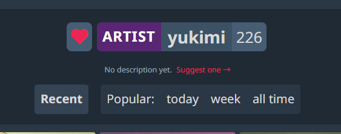
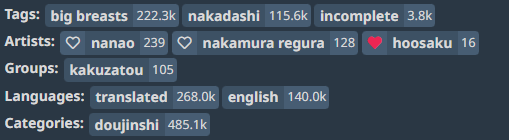
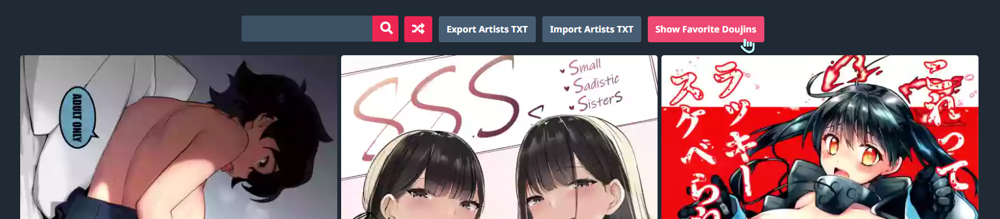

# n-artists


A userscript to favourite nhentai artists. It should work on `/g/.../`, `/artist/` and `/favorites/` pages. The list of favourite artists is always stored in LocalStorage.

## Demo

Artist Page:



Artwork Page:



Favorites Page:



## Features

Aside from the main functionality, it also

- Allow importing and exporting favourite artists as a list txt file.
- ~~Give a recommendation of artists based on your current favourite artwork gallery.~~ Not implemented yet, but will be in the future.
- ~~Allow storing the list to Google Drive to use the list across devices and avoid losing it (for example, when your browser data is cleared).~~ Not implemented yet, but will be in the future.

## Installation

1. Install a userscript manager like [Tampermonkey](https://www.tampermonkey.net/) or [Greasemonkey](https://www.greasespot.net/)
2. Install the userscript:
   - [Raw File Link](https://raw.githubusercontent.com/SisypheOvO/n-artists/main/dist/n-artists.user.js)
3. Visit any nhentai page to see it in action. You are all set then.
4. make sure to turn on AutoUpdate in your userscript manager to get the latest updates.

## Development

```bash
npm i # install dependencies
npm run build # build the userscript
```
